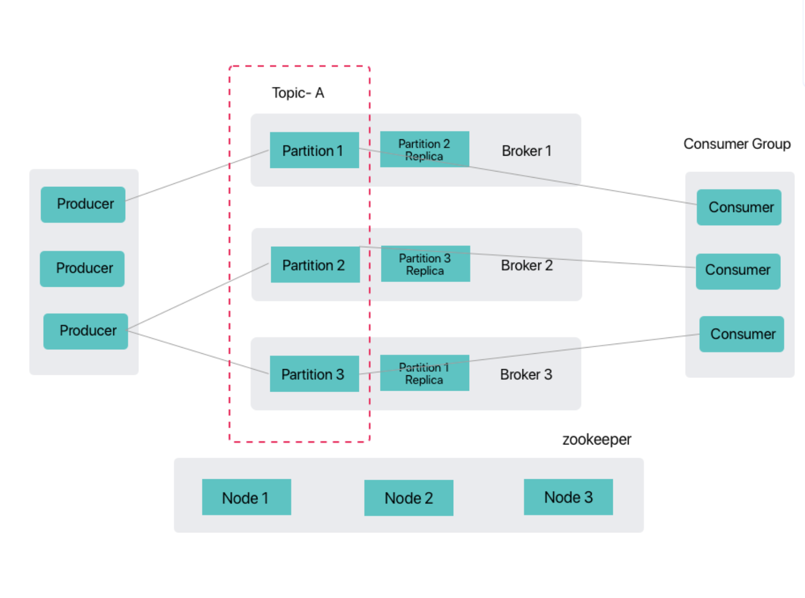

# Architecture

The full-stack cloud-native open platform leverages the distributed characteristics of Kafka by offering a classic high-availability architecture based on ZooKeeper, meeting enterprises' needs for high throughput, high reliability, and elastic scalability in messaging queues.

## ZooKeeper Coordination Mode

The ZooKeeper coordination mode is the traditional distributed coordination implementation for Kafka, utilizing a ZooKeeper cluster to manage Kafka cluster metadata, Broker registration, and controller election, among other core functionalities. This mode has the following characteristics:

- **Mature and Stable**: Verified in large-scale production environments, it has extremely high reliability.
- **Separation of Concerns**: ZooKeeper focuses on cluster coordination, while Kafka Brokers concentrate on message processing.
- **Automatic Failover**: Controller automatic election achieved via ZooKeeper's Watcher mechanism.
- **Metadata Management**: Stores key metadata such as topic partition information and consumer offsets.
- **Expansion Dependency**: Requires additional maintenance of a ZooKeeper cluster, introducing operational complexity.

### Core Components

1. **ZooKeeper Cluster**\
   A highly available cluster consisting of an odd number of nodes, responsible for the following tasks:
   - Broker registration and health monitoring.
   - Controller election and failover.
   - Topic/partition metadata storage.
   - Consumer group offset management (deprecated versions).

2. **Kafka Broker Cluster**\
   A messaging processing cluster composed of multiple Broker nodes:
   - Each Broker registers with ZooKeeper upon startup.
   - Partition leader elections are conducted via the controller.
   - Supports horizontal scaling, increasing throughput by adding Brokers.
