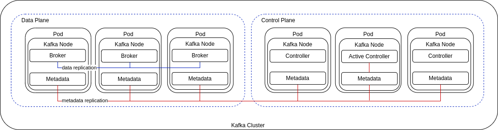

# Architecture

Alauda Streaming Service for Kafka leverages Kafka's distributed architecture to provide a proven high-availability solution, meeting enterprise requirements for high-throughput, reliable, and elastically scalable message queuing systems.

## KRaft Mode

KRaft mode is Kafka's next-generation metadata management system, which replaces ZooKeeper with Kafka's native Raft-based consensus protocol. This mode offers the following characteristics:

- **Simplified Architecture**: Eliminates the external ZooKeeper dependency, reducing operational complexity.
- **Enhanced Scalability**: Supports significantly more partitions (up to millions, compared to hundreds of thousands in ZooKeeper mode).
- **Faster Controller Failover**: Achieves sub-second failover, a substantial improvement over ZooKeeper's multi-second failover latency.
- **Stronger Consistency**: Ensures linearizable metadata operations, providing stronger consistency guarantees than the eventual consistency of ZooKeeper-based metadata.
- **Flexible Deployment**: Supports both combined mode (unified processes acting as both brokers and controllers, suitable for small clusters) and dedicated mode (separate controller and broker processes, ideal for large-scale deployments).

