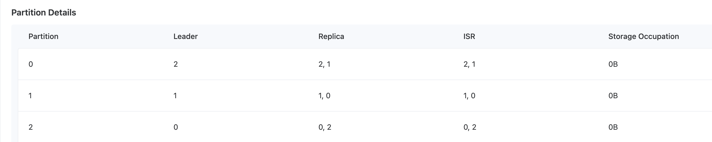

# Topic Management

A Topic is a data theme. Producers write information into a Topic, and consumers read information from the Topic. Topics achieve distributed message storage through partitions.

## Creating a Topic

<Tabs>
  <Tab label="Web Console">
    1. Click on **Kafka** in the left navigation bar.
    2. Click on the target namespace name.
    3. Click on the target instance name.
    4. In the **Topic Management** tab, click on **Create Topic**.
    5. Fill in the Topic information.
       **Note**: If the **Topic Name** field is not set, the Topic name will be consistent with the name of the created Kubernetes resource (the **Name** field).
    6. Click on **Create**.
  </Tab>
</Tabs>

> Replica example: The replica of Partition 0 is distributed across Broker 2 (Leader) and Broker 1 (Follower)

## Synchronizing a Topic

<Tabs>
  <Tab label="Web Console">
    1. Click on **Kafka** in the left navigation bar.
    2. Click on the target namespace name.
    3. Click on the target instance name.
    4. In the **Topic Management** tab, click on **Synchronize Topic**.
    5. In the pop-up window, select the Topic with the status **Running**.
    6. Click on **Synchronize**.
  </Tab>
</Tabs>

## Expanding Topic Partitions

<Tabs>
  <Tab label="Web Console">
    1. Click on **Kafka** in the left navigation bar.
    2. Click on the target namespace name.
    3. Click on the target instance name.
    4. In the **Topic Management** tab, click on the target Topic name.
    5. Click on **Actions > Expand Partitions**.
    6. Set the number of new partitions and select Brokers.
    7. Click on **Expand**.
  </Tab>
</Tabs>

## Managing Topic Partitions

<Tabs>
  <Tab label="Web Console">
    1. Click on **Kafka** in the left navigation bar.
    2. Click on the target namespace name.
    3. Click on the target instance name.
    4. In the **Topic Management** tab, click on the target Topic name.
    5. Click on **Actions > Manage Partitions**.
    6. Configure the Broker locations for each partition's replicas.
    7. Click on **Apply**.
  </Tab>
</Tabs>
