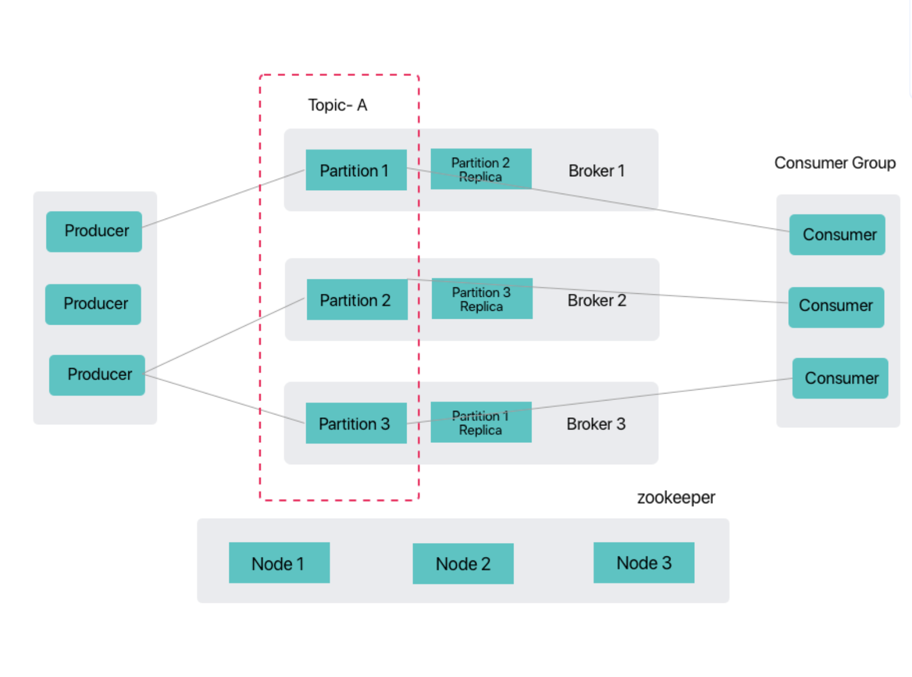

# 架构

全栈云原生开放平台针对 Kafka 的分布式特性，提供了基于 ZooKeeper 的经典高可用架构，满足企业对消息队列的高吞吐、高可靠和弹性扩展需求。

## ZooKeeper 协调模式

ZooKeeper 协调模式是 Kafka 传统的分布式协调实现方式，通过 ZooKeeper 集群管理 Kafka 集群的元数据、Broker 注册、控制器选举等核心功能。该模式具有以下特点：

* **成熟稳定**：经过大规模生产环境验证，具备极高的可靠性
* **职责分离**：ZooKeeper 专注集群协调，Kafka Broker 专注消息处理
* **自动故障转移**：通过 ZooKeeper 的 Watcher 机制实现控制器自动选举
* **元数据管理**：存储主题分区信息、消费者偏移量等关键元数据
* **扩展依赖**：需额外维护 ZooKeeper 集群，存在运维复杂度

### 核心组件
1. **ZooKeeper 集群**  
   由奇数节点组成的高可用集群，承担以下职责：
   - Broker 注册与健康监测
   - 控制器（Controller）选举与故障转移
   - 主题/分区元数据存储
   - 消费者组偏移量管理（旧版本）

2. **Kafka Broker 集群**  
   由多个 Broker 节点组成的消息处理集群：
   - 每个 Broker 启动时向 ZooKeeper 注册
   - 通过控制器进行分区Leader选举
   - 支持横向扩展，通过增加 Broker 提升吞吐量

{/* ## 架构选择

|               | 需要成熟稳定方案 | 已有 ZK 基础设施 | 接受运维复杂度 | 需 Exactly-Once 语义 |
|:--------------|:----------------|:-----------------|:---------------|:---------------------|
| ZooKeeper 模式 | ✓               | ✓                | ✓              | ✓                    | */}