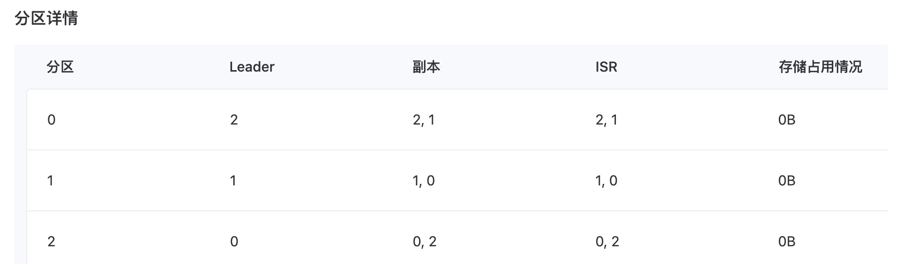

# Topic 管理

Topic 即数据主题。生产者会将信息写入 Topic，消费者从 Topic 中读取信息。Topic 通过分区实现消息的分布式存储。

## 创建 Topic
<Tabs>

<Tab label="Web Console">
1. 在左侧导航栏中，单击 **Kafka**。
2. 单击目标命名空间名称。
3. 单击目标实例名称。
4. 在 **Topic 管理** 页签中，单击 **创建 Topic**。
5. 填写 Topic 信息。
   **注意**：若不设置 **Topic 名称** 字段，Topic 名称将与创建的 Kubernetes 资源名称（**名称** 字段）保持一致。
6. 单击 **创建**。

</Tab>
</Tabs>

> 分区副本示例：分区 0 的副本分布在 Broker 2（Leader）和 Broker 1（Follower）

## 同步 Topic

<Tabs>

<Tab label="Web Console">
1. 在左侧导航栏中，单击 **Kafka**。
2. 单击目标命名空间名称。
3. 单击目标实例名称。
4. 在 **Topic 管理** 页签中，单击 **同步 Topic**。
5. 在弹窗中选择状态为 **运行中** 的 Topic。
6. 单击 **同步**。

</Tab>
</Tabs>

## 扩展 Topic 分区

<Tabs>

<Tab label="Web Console">

1. 在左侧导航栏中，单击 **Kafka**。
2. 单击目标命名空间名称。
3. 单击目标实例名称。
4. 在 **Topic 管理** 页签中，单击目标 Topic 名称。
5. 单击 **操作 > 扩展分区**。
6. 设置新增分区数并选择 Broker。
7. 单击 **扩展**。
</Tab>
</Tabs>

## 管理 Topic 分区

<Tabs>

<Tab label="Web Console">
1. 在左侧导航栏中，单击 **Kafka**。
2. 单击目标命名空间名称。
3. 单击目标实例名称。
4. 在 **Topic 管理** 页签中，单击目标 Topic 名称。
5. 单击 **操作 > 管理分区**。
6. 配置各分区副本的 Broker 位置。
7. 单击 **应用**。

</Tab>
</Tabs>
